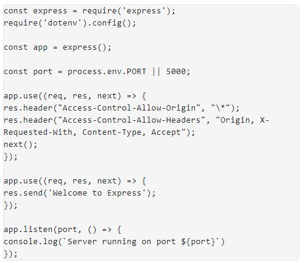
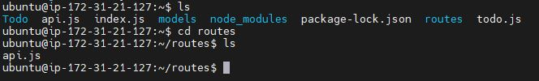
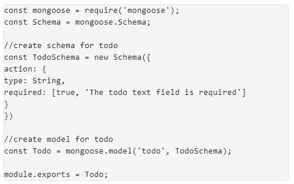
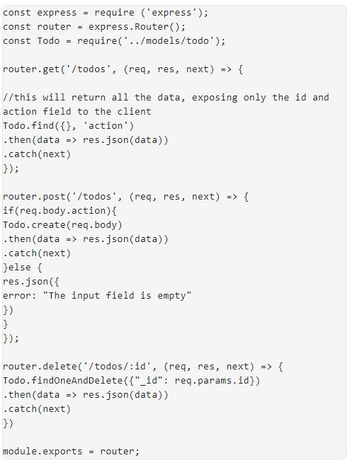

### DOCUMENTATION OF PROJECT-3 MERN STACK IMPLEMENTATION

### 
SIMPLE TO-DO APPLICATION ON MERN WEB STACK

In this project I would be creating a simple To-Do application

 

To achieve this I would be deploying a web solution based on MERN stack in AWS Cloud.

I will need to setup an instance of t2.nano family with Ubuntu Server 20.04 LTS (HVM) image, install & configure the following : - 

Node.JS

Expressjs 

Mongodb database.

### STEP 1 – BACKEND CONFIGURATION

Now launch an Instance of t2.nano with Ubuntu Server 20.04 LTS (HMV) image

First update and upgrade Ubuntu by running the following commands

<code>sudo apt update</code>

Then upgrade ubuntu

<code>sudo apt upgrade</code>

Lets get the location of Node.js software from Ubuntu repositories.

<code>curl -sL https://deb.nodesource.com/setup_12.x | sudo -E bash -</code>

To install Node.js on the server, run the command;

<code>sudo apt-get install -y nodejs</code> 

Note: The command also installs both node.js and npm, NPM is a package manager for Node like apt for Ubuntu, it is used to install Node modules & packages; also manage dependency conflicts

Verify the node installation with the command below

<code>node -v</code>

Verify the node installation with the command below

<code>npm -v </code>

Application Code Setup

Create a new directory for your To-Do project:

<code>mkdir Todo</code>

Run the command below to verify that the Todo directory is created with ls command

<code>ls</code>

Next, you will use the command npm init to initialise your project, so that a new file named package.json will be created. This file will normally contain information about your application and the dependencies that it needs to run. Follow the prompts after running the command. You can press Enter several times to accept default values, then accept to write out the package.json file by typing yes.

Now change your current directory to the newly created one:

<code>cd Todo</code>

<code>npm init</code>

*Installation continued*

Next, we will Install ExpressJs and create the Routes directory.

## INSTALL EXPRESSJS

Express is a framework for Node.js, therefore a lot of things developers would have programmed is already taken care of out of the box. Therefore it simplifies development, and abstracts a lot of low level details. For example, Express helps to define routes of your application based on HTTP methods and URLs.

To use express, install it using npm:

<code>npm install express</code>

Now create a file index.js with the command below

<code>touch index.js</code>

Run ls to confirm that your index.js file is successfully created

<code>Install the dotenv module</code>

<code>npm install dotenv</code>

Open the index.js file with the command below

<code>vim index.js</code>

Type the code below into it and save. Do not get overwhelmed by the code you see. For now, simply paste the code into the file.

*Vim Editor*

Notice that we have specified to use port 5000 in the code. This will be required later when we go on the browser.

Use :w to save in vim and use :qa to exit vim

Now it is time to start our server to see if it works. Open your terminal in the same directory as your index.js file and type:

<code>node index.js</code>

If every thing goes well, you should see Server running on port 5000 in your terminal.

Now we need to open this port in EC2 Security Groups by creating an inbound rule to open TCP port 5000.

Now open up your browser and try to access your server’s Public IP or Public DNS name followed by port 5000:

<code>http://13.40.128.221:5000</code>

Routes

There are three actions that To-Do application needs to be able to do:

1.Create a new task

2.Display list of all tasks

3.Delete a completed task

Each task will be associated with some particular endpoint and will use different standard HTTP request methods: POST, GET, DELETE.

For each task, we need to create routes that will define various endpoints that the To-do app will depend on. To begin I will have to create a folder routes

<code>mkdir routes</code>

Change directory to routes folder.

<code>cd routes</code>

Now, create a file api.js with the command below

<code>touch api.js</code>

Open the file with the command below

<code>vim api.js</code>

Copy below code in the file.

*Vim Editor*

Next stage is to create *Models* directory.

# MODELS
Since the application will be using Mongodb which is a NoSQL database, we need to create a model. A model is the at the heart of JavaScript based applications, and it is what makes it interactive. The model will be used to define the database schema, this will define the fields stored in each Mongodb document.

To create a Schema and a model, install mongoose which is a Node.js package that makes working with mongodb easier.

Change directory back Todo folder with cd .. and install Mongoose

<code>npm install mongoose</code>

Create a new folder models :

<code>mkdir models</code>

Change directory into the newly created ‘models’ folder with

<code>cd models</code>

Inside the models folder, create a file and name it todo.js

<code>touch todo.js</code>

All three commands above can be defined in one line to be executed consequently with help of && operator, like this:

<code>mkdir models && cd models && touch todo.js</code>

Open the file created with vim todo.js then paste the code below in the file:

Now we need to update our routes from the file api.js in ‘routes’ directory to make use of the new model.

In Routes directory, open api.js with vim api.js, delete the code inside with :%d command and paste there code below into it then save and exit

The next stage of the application will be the MongoDB Database

## MONGODB DATABASE 

We need a database where we will store our data. For this we will make use of mLab. mLab provides MongoDB database as a service solution (DBaaS), so to make life easy, you will need to sign up for a shared clusters free account, which is ideal for our use case.[Sign up here](https://www.mongodb.com/atlas-signup-from-mlab). Follow the sign up process.

Click on build database.

select AWS as the cloud provider, choose a region near you and click on create cluster button. 

For this project I will be using the free cluster option.

Next create a database username and password.

Next configure Network Access, select allow access from anywhere and click the confirm button

Network Access configured

Next is to configure the database, click on database and then connect button

Click on connect your application 

