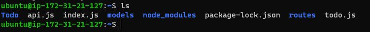

## DOCUMENTATION OF PROJECT-3 MERN STACK IMPLEMENTATION

### SIMPLE TO-DO APPLICATION ON MERN WEB STACK

In this project I would be creating a simple To-Do application

 

To achieve this I would be deploying a web solution based on MERN stack in AWS Cloud.

I will need to setup an instance of t2.nano family with Ubuntu Server 20.04 LTS (HVM) image, install & configure the following : - 

ReactJS

Node.JS

ExpressJS 

Mongodb database.

### STEP 1 – BACKEND CONFIGURATION

Now launch an Instance of t2.nano with Ubuntu Server 20.04 LTS (HMV) image

First update and upgrade Ubuntu by running the following commands

<code>sudo apt update</code>

Then upgrade ubuntu

<code>sudo apt upgrade</code>

Lets get the location of Node.js software from Ubuntu repositories.

<code>curl -sL https://deb.nodesource.com/setup_12.x | sudo -E bash -</code>

To install Node.js on the server, run the command;

<code>sudo apt-get install -y nodejs</code> 

Note: The command also installs both nodejs and npm, NPM is a package manager for Node like apt for Ubuntu, it is used to install Node modules & packages; also manage dependency conflicts

Verify the node installation with the command below

<code>node -v</code>

Verify the node installation with the command below

<code>npm -v </code>

Application Code Setup

Create a new directory for your To-Do project:

<code>mkdir Todo</code>

Run the command below to verify that the Todo directory is created with ls command

<code>ls</code>

Next, you will use the command npm init to initialise your project, so that a new file named package.json will be created. This file will normally contain information about your application and the dependencies that it needs to run. Follow the prompts after running the command. You can press Enter several times to accept default values, then accept to write out the package.json file by typing yes.

Now change your current directory to the newly created one:

<code>cd Todo</code>

<code>npm init</code>

*Installation continued*

Next, we will Install ExpressJs and create the Routes directory.

## INSTALL EXPRESSJS

Express is a framework for Node.js, therefore a lot of things developers would have programmed is already taken care of out of the box. Therefore it simplifies development, and abstracts a lot of low level details. For example, Express helps to define routes of your application based on HTTP methods and URLs.

To use express, install it using npm:

<code>npm install express</code>

Now create a file index.js with the command below

<code>touch index.js</code>

Run ls to confirm that your index.js file is successfully created

Install the dotenv module

<code>npm install dotenv</code>

Open the index.js file with the command below

<code>vim index.js</code>

Type the code below into it and save. Do not get overwhelmed by the code you see. For now, simply paste the code into the file.

*Vim Editor*

Notice that we have specified to use port 5000 in the code. This will be required later when we go on the browser.

Use :w to save in vim and use :qa to exit vim

Now it is time to start our server to see if it works. Open your terminal in the same directory as your index.js file and type:

<code>node index.js</code>

If every thing goes well, you should see Server running on port 5000 in your terminal.

Now we need to open this port in EC2 Security Groups by creating an inbound rule to open TCP port 5000.

Now open up your browser and try to access your server’s Public IP or Public DNS name followed by port 5000:

<code>http://13.40.128.221:5000</code>

# Routes

There are three actions that To-Do application needs to be able to do:

1.Create a new task

2.Display list of all tasks

3.Delete a completed task

Each task will be associated with some particular endpoint and will use different standard HTTP request methods: POST, GET, DELETE.

For each task, we need to create routes that will define various endpoints that the To-do app will depend on. To begin I will have to create a folder routes

<code>mkdir routes</code>

Change directory to routes folder.

<code>cd routes</code>

Now, create a file api.js with the command below

<code>touch api.js</code>

Open the file with the command below

<code>vim api.js</code>

Copy below code in the file.

*Vim Editor*

Next stage is to create *Models* directory.

# MODELS
Since the application will be using Mongodb which is a NoSQL database, we need to create a model. A model is the at the heart of JavaScript based applications, and it is what makes it interactive. The model will be used to define the database schema, this will define the fields stored in each Mongodb document.

To create a Schema and a model, install mongoose which is a Node.js package that makes working with mongodb easier.

Change directory back Todo folder with cd .. and install Mongoose

<code>npm install mongoose</code>

Create a new folder models :

<code>mkdir models</code>

Change directory into the newly created ‘models’ folder with

<code>cd models</code>

Inside the models folder, create a file and name it todo.js

<code>touch todo.js</code>

All three commands above can be defined in one line to be executed consequently with help of && operator, like this:

<code>mkdir models && cd models && touch todo.js</code>

Open the file created with vim todo.js then paste the code below in the file:

Now we need to update our routes from the file api.js in ‘routes’ directory to make use of the new model.

In Routes directory, open api.js with vim api.js, delete the code inside with :%d command and paste there code below into it then save and exit

The next stage of the application will be the MongoDB Database

## MONGODB DATABASE 

We need a database where we will store our data. For this we will make use of mLab. mLab provides MongoDB database as a service solution (DBaaS), so to make life easy, you will need to sign up for a shared clusters free account, which is ideal for our use case.[Sign up here](https://www.mongodb.com/atlas-signup-from-mlab). 

Follow the sign up process

Select AWS as the cloud provider, choose a region near you and click on create cluster button. 

For this project I will be using the free cluster option.

Next create a database username and password.

Allow access to the MongoDB database from anywhere (Not secure, but it is ideal for testing)

IMPORTANT NOTE
In the image below, make sure you change the time of deleting the entry from 6 Hours to 1 Week

Create a MongoDB database and collection inside mLab

Browse Collections

Setup database information i.e Database name etc  

In the index.js file, we specified process.env to access environment variables, but we have not yet created this file. So we need to do that now.

Create a file in your Todo directory and name it .env.

<code>touch .env</code>

<code>vi .env</code>

Add the connection string to access the database in it, just as below:

Ensure to update username, password, network-address and database according to your setup

Here is how to get your connection string

Next is to configure the database, click on database and then connect button

Click on connect your application 

Now we need to update the index.js to reflect the use of .env so that Node.js can connect to the database.

Simply delete existing content in the file, and update it with the entire code below.

To do that using vim, follow below steps

Open the file with vim index.js

Press esc

Type :

Type %d

Hit ‘Enter’

The entire content will be deleted, then, 

Press i to enter the insert mode in vim

Now, paste the entire code below in the file.

Using environment variables to store information is considered more secure and best practice to separate configuration and secret data from the application, instead of writing connection strings directly inside the index.js application file.

Start the server using the command:

<code>node index.js</code>

Database connected successfully means backend has been configured, Now I am going to test it using RESTful API. 

## Testing Backend Code without Frontend using RESTful API

So far we have written backend part of our To-Do application, and configured a database. But I do not have a frontend UI yet. I will need ReactJS code to achieve that, while developing I need a way to test my code by using RESTfulL API. 

Therefore, I will need to make use of some API development client to test the code.

In this project, we will use Postman to test our API. Click Install Postman to download and install postman on your machine.

In this project, we will use [Postman](https://www.postman.com/) to test our API. [Click Install ](https://www.postman.com/downloads/)Postman to download and install postman on your machine.

Test all the API endpoints and make sure they are working. For the endpoints that require body, I will send JSON back with the necessary fields since it’s what I setup in my code.

Now open Postman, create a POST request to the *API http://<PublicIP-or-PublicDNS>:5000/api/todos*. 

This request sends a new task to our To-Do list so the application could store it in the database.

Note: make sure your set header key Content-Type as application/json

In the body type in an action "action":"Working on Project - 3"

Create a GET request to your API on http://<PublicIP-or-PublicDNS>:5000/api/todos. 

This request retrieves all existing records from out To-do application (backend requests these records from the database and sends it us back as a response to GET request).

The POST & GET request tested and worked no errors, this completes the backend part of the To-Do application and all three operations works.

1. Display a list of tasks – HTTP GET request
2. Add a new task to the list – HTTP POST request
3. Delete an existing task from the list – HTTP DELETE request

I have successfully created our Backend, now let go create the Frontend.

## FRONTEND CREATION

Since we are done with the functionality we want from our backend and API, it is time to create a user interface for a Web client (browser) to interact with the application via API. To start out with the frontend of the To-do app, we will use the create-react-app command to scaffold our app.

In the same root directory as your backend code, which is the Todo directory, run:

 <code>npx create-react-app client</code>

This will create a new folder in your Todo directory called client, where you will add all the react code.

*Running a React App*

Before testing the react app, there are some dependencies that need to be installed.

1.Install concurrently. It is used to run more than one command simultaneously from the same terminal window.

<code> npm install concurrently --save-dev</code>

2.Install nodemon. It is used to run and monitor the server. If there is any change in the server code, nodemon will restart it automatically and load the new changes.

<code>npm install nodemon --save-dev</code>

3.In Todo folder open the package.json file. Change the highlighted part of the below screenshot and replace with the code below.

*Configure Proxy in package.json*

1.Change directory to ‘client’

<code>cd client</code>

2.Open the package.json file

<code>vi package.json</code>

3.Add the key value pair in the package.json file "proxy": "http://localhost:5000".

The whole purpose of adding the proxy configuration in number 3 above is to make it possible to access the application directly from the browser by simply calling the server url like http://localhost:5000 rather than always including the entire path like http://localhost:5000/api/todos

Now, ensure you are inside the Todo directory, and simply do:

<code>npm run dev</code>

Your app should open and start running on localhost:3000, create an inbound rule for port 3000

*Created an inbound rule*

Now open web browser, type in public IP & port 3000. Which is http://13.40.197.221:3000

### Creating your React Components

One of the advantages of react is that it makes use of components, which are reusable and also makes code modular. For our Todo app, there will be two stateful components and one stateless component.

From your Todo directory run

<code>cd client</code>

move to the src directory

<code>cd src</code>

Inside your src folder create another folder called components

<code>mkdir components</code>

Move into the components directory with

<code>cd components</code>

Inside ‘components’ directory create three files Input.js, ListTodo.js and Todo.js.

<code>touch Input.js ListTodo.js Todo.js</code>

Open Input.js file

<code>vi Input.js</code>

Copy and paste the following

To make use of Axios, which is a Promise based HTTP client for the browser and node.js, you need to cd into your client from your terminal and run yarn add axios or npm install axios.

Move to the src folder

<code>cd .. </code>

Move to clients folder

<code>cd ..</code>

Install Axios

<code>install npm install axios</code>

Go to ‘components’ directory

<code>sc src/components</code>

After that open your ListTodo.js

<code>vi ListTodo.js</code>

In the ListTodo.js copy and paste the following code

*vi ListTodo.js*

%20vi%20ListTodo.JPG)

Then in your Todo.js file you write the following code

*vim  Todo.js*

%20vi%20Todo.JPG)

I will need to make little adjustment to react code. Delete the logo and adjust our App.js to look like this.

Move to the src folder

<code>cd ..</code>

Then make sure change to src folder and run

<code>vi App.js</code>

Copy and paste the code below into it

*Vi App.js*

%20vi%20App.JPG)

After pasting, exit the editor.

In the src directory open the App.css

<code>vi App.css</code>

Then paste the following code into App.css:

Exit

In the src directory open the index.css

<code>vim index.css</code>

Copy and paste the code below:

<code>
body {
margin: 0;
padding: 0;
font-family: -apple-system, BlinkMacSystemFont, "Segoe UI", "Roboto", "Oxygen",
"Ubuntu", "Cantarell", "Fira Sans", "Droid Sans", "Helvetica Neue",
sans-serif;
-webkit-font-smoothing: antialiased;
-moz-osx-font-smoothing: grayscale;
box-sizing: border-box;
background-color: #282c34;
color: #787a80;
}

code {
font-family: source-code-pro, Menlo, Monaco, Consolas, "Courier New",
monospace;
}
</code>

Go to the Todo directory

<code>cd ../..</code>

When you are in the Todo directory run command to launch Todo application

<code>npm run dev</code>

 I have successfully created a simple To-do application deployed it to MERN stack. This involved writing an application using React.js which communicates with a backend application written using Expressjs.used Mongodb backend for storing task in a database.

 END...

